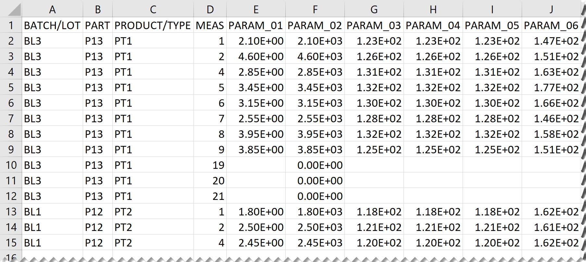
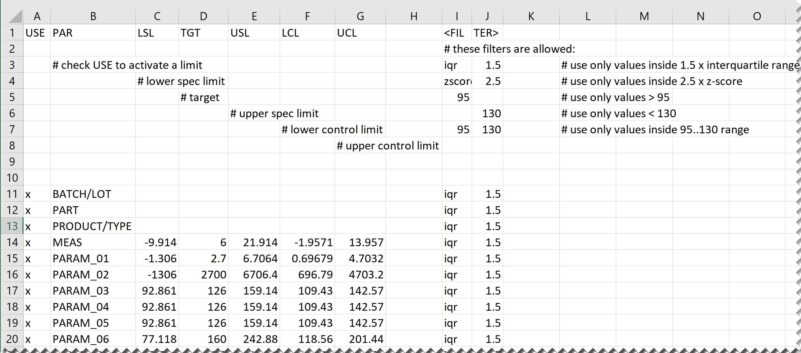
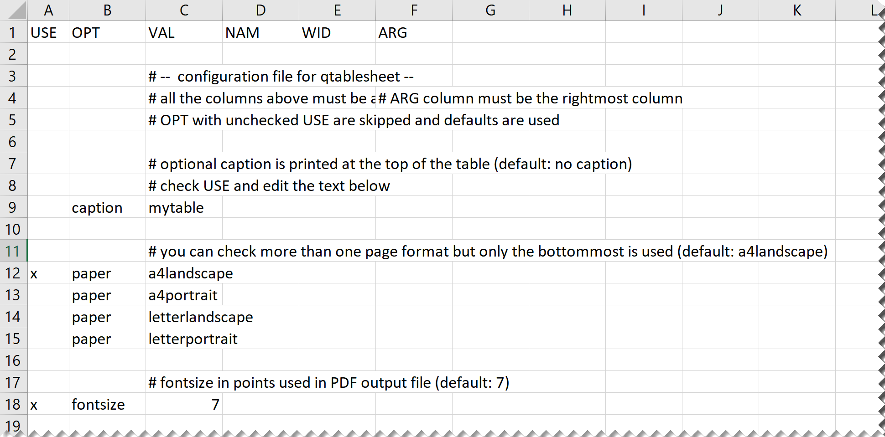
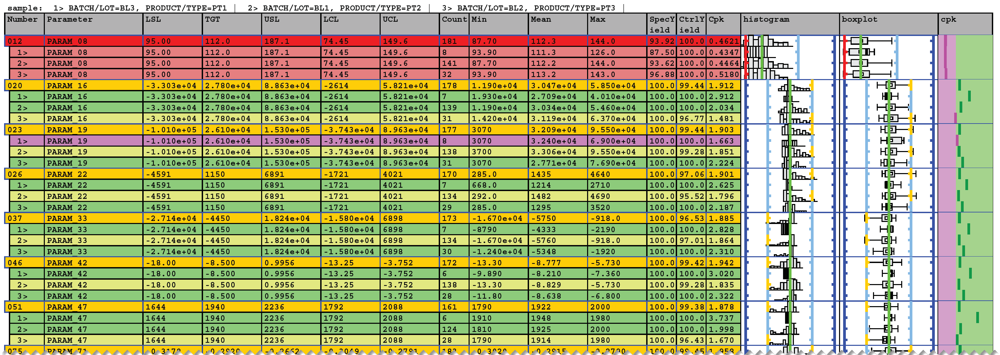

# qtablesheet

`qtablesheet` is a program for creating PDF documents containing quality information for many parameters at a glance.\
Parameters must be provided as CSV (comma sparated values) file in 'wide' format, i.e. every parameter is a column.\
Grouping by categorical parameters is optional.

## Usage
```
 HINT: at least one CSV data file must be provided.
USAGE:     > qtablesheet data.csv [limits.csv] [config.csv] (at least the data.csv must be provided)
        OR > qtablesheet help (to plot this help)
        OR > qtablesheet samples (to create sample_data.csv, sample_limits.csv, sample_config.csv files)
        OR > qtablesheet data.csv limits (to derive an initial limits.csv from data.csv)

         * data.csv: a CSV file in wide format containing the data
         * limits.csv: a CSV file containing limits, filters
         * config.csv: a CSV file containing settings for target\release\qtablesheet.exe
```
## Input/Output files

The sample CSV data, limits, configuration files are in [data directory](data).
They can be created with the command 'qtablesheet samples'.\
This may be useful, because the format of the CSV limits and configuration files must be kept.\
A spreadsheet program would be the best choice to edit these files. 

---

The [CSV data file](data/sample.dat.csv) must contain a header row. The column names don't have to be unique, because parameters are identified by column number (starting from 1) and name.
Empty columns/rows will be skipped.



---

Parameter specific spec and/or control limits and/or filters to apply to the data before computation can be set in an optional [CSV limits file](data/sample.lim.csv).\
Only with a CSV limits file provided, yields and Cpk will be computed and the parameters in the PDF output can be color marked.\
See below for color marking.\
Limits/Filters can be switched on/off with a checkmark in the USE column.



---

The [CSV config file](data/sample.cfg.csv) contains settings for the creation of the [PDF output file](data/sample.dat.pdf).\
Also the column types, names, and width to build the table from, are specified here.



The sample [CSV config file](data/sample.cfg.csv) contains all the settings and columns, which are possible.\
Again, selection is done by checkmarks in the USE column.  

```csv
USE	OPT	VAL	NAM	WID	ARG	
						
		# --  configuration file for qtablesheet --				
		# all the columns above must be available.			# ARG column must be the rightmost column	
		# OPT with unchecked USE are skipped and defaults are used				
						
		# optional caption is printed at the top of the table (default: no caption)				
		# check USE and edit the text below				
x	caption	sample				
						
		# you can check more than one page format but only the bottommost is used (default: a4landscape)				
x	paper	a4landscape				
	paper	a4portrait				
	paper	letterlandscape				
	paper	letterportrait				
						
		# fontsize in points used in PDF output file (default: 7)				
x	fontsize	7				
						
		# folder the output PDF file should be written (default: current folder)				
x	pdffolder	data				
						
		# filename of the output PDF file (default: data CSV file name with .pdf appended)				
	pdffile					
						
		#  optional timestamp appended to the output PDF file name (default: no timestamp) 				
		# bottommost checked is used				
x	pdftimestamp	none				
	pdftimestamp	local				
	pdftimestamp	utc				
						
		# should the table be ordered with bad parameters first or by number (default: bybadgood)				
		# bottommost checked is used				
x	order	bybadgood				
	order	bynumber				
						
		# by which limits should the boxplot and histogram trends be aligned (default: by spec limits)				
		# bottommost checked is used				
x	align	spec				
	align	control				
	align	target				
						
		# which limits should be shown in boxplot and histogram trends (default: all [none checked also means all checked])				
		# all checked are used				
x	show	spec				
x	show	control				
x	show	target				
						
		# limit for which specyield is color marked as bad if specyield is lower (default: 100.0)				
x	specyieldlimit	100				
						
		# limit for which ctrlyield is color marked as bad if ctrlyield is lower (default: 100.0)				
x	ctrlyieldlimit	100				
						
		# limit for which cpk is color marked as bad if cpk is lower (default: 1.67)				
x	cpklimit	1.67				
						
		# number of bins for histograms (default: 11)				
x	histobins	11				
						
		# which limits should be used for color marking and bybadgood sorting (default: all [none checked also means all checked])				
		# all checked are used				
x	mark	specyield				
x	mark	ctrlyield				
x	mark	cpk				
						
		# string to use for empty values (default: empty string)				
x	nanstring					
						
		# significant digits for display of floating point numbers (default: 4)				
x	sigdigits	4				
						
		# numbers (may be reserved for  error codes) above this limit are cut off before computing stats (default: 1.79e+308)				
	floatlimit	1.00E+18				
						
		# filter to apply to all parameters after floatlimit cutoff (default: no filter)				
		# filters set in the limits CSV file overwrite these per parameter				
		# bottommost checked is used				
	filter	iqr	1.5			
	filter	zscore	2.5			
						
		# parameters used for grouping (column numbers starting from 1 and/or names can be mixed)				
x	groupby	BATCH/LOT	3			
						
		# heads of group rows by long group names or group numbers (default: numbers)				
		# the long group names always appear also on top of the table				
		# bottommost checked is used				
x	groupnames	numbers				
x		longnames				
						
		# columns checked in top-down order here will added to the table in left-right order 				
		# the column type				
			# your own name of this column			
				# the width of the column in %		
x	column	number	Number	4		#Column Number is always included only name and width can be changed here
x	column	parameter	Parameter	10		#Column Parameter is always included only name and width can be changed here
x	column	lsl	LSL	6		
x	column	tgt	TGT	6		
x	column	usl	USL	6		
x	column	lcl	LCL	6		
x	column	ucl	UCL	6		
x	column	count	Count	3		
x	column	min	Min	6		
x	column	mean	Mean	6		
x	column	max	Max	6		
x	column	specyield	SpecYield	3		
x	column	ctrlyield	CtrlYield	3		
x	column	cpk	Cpk	3.5		
x	column	histogram	histogram	10		
x	column	boxplot	boxplot	10		
x	column	cpkplot	cpk	5.5		
	column	median	Median	6		
	column	variance	Variance	6		
	column	stddev	Sdev	6		
	column	range	Range	6		
	column	k	K	6		
	column	cp	Cp	6		
	column	perc	Perc 80	6	80	
	column	p25	P25	6		
	column	p75	P75	6		

```

---

The [PDF sample file](data/sample.dat.pdf) created with the sample CSV data, limits, and config file.\
Because the OPT 'order' was set to 'bybadgood' the 'bad' parameters are moved to the top of the table.\
The order is from top to bottom:
- spec yield is bad according to spec limits (red marked)
- ctrl yield is bad according to ctrl limits (yellow marked)
- cpk is bad according to spec limits (violet marked)
- all yields and cpk are good (green marked)
- no limits or values available or not applicable (white marked)
The move of 'bad' parameters is only done for the main rows, not for the intented 'groupby' subrows.
Those are always ordered by group number.



## Installation
```
git clone https://github.com/foundrysheets/qtablesheet
cd qtablesheet
cargo install
```

## Library
The supporting library 'qtablepdf' is designed to back the 'qtablesheet' executable.\
Therefore it is sparse commented.\
However, it could be used this way:

```
    let mut qtableprops = default_props();
    qtableprops.pdftimestamp = PDFTimestamp::UTC;
    qtableprops.group_by = vec![GroupBy::ColName("BATCH".into()), GroupBy::ColNumber(1)];
    qtableprops.longgroupnames = true;

    let columns = vec![
        Column::Number("num".to_string(), 5.),
        Column::Parameter("parameter".to_string(), 10.),
        Column::LSL("lsl".to_string(), 5.),
        Column::TGT("tgt".to_string(), 5.),
        Column::USL("usl".to_string(), 5.),
        Column::Min("min".to_string(), 5.),
        Column::Median("med".to_string(), 5.),
        Column::Mean("mean".to_string(), 5.),
        Column::Max("max".to_string(), 5.),
        Column::Cpk("cpk".to_string(), 5.),
        Column::Histogram("histogram".to_string(), 10.),
        Column::Boxplot("boxplot".to_string(), 10.),
        Column::Cpkplot("cpkchart".to_string(), 10.),
    ];

    //    columns.replace(3, Column::Cpk("CPK".to_string(), 10.))?; // securely change column
    //    columns.delete(0)?; // securely delete column

    let datpath = fpath(vec!["data", "sample-dat.csv"]);
    let limpath = fpath(vec!["data", "sample-lim.csv"]);

    let mut pdf = Pdf::new(&Paper::A4Portrait);
    QTable::new(&mut pdf, &datpath, &limpath, &columns, &qtableprops)?;

    let pdfpath = pdf.save("", "sample.pdf", &PDFTimestamp::UTC)?;

```


